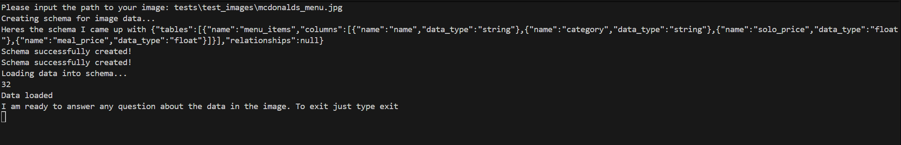
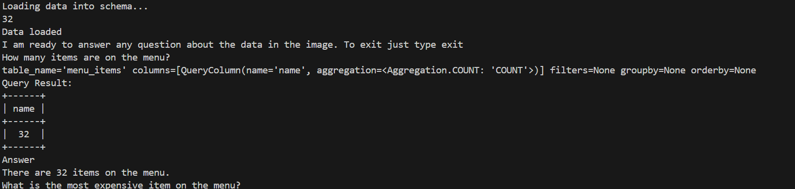
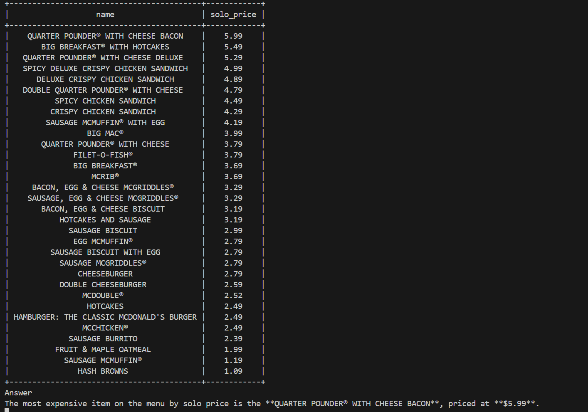
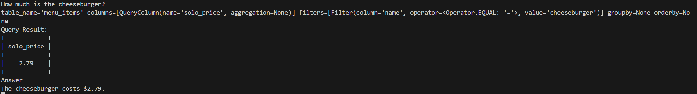

# Ask the image

Ask the image is an idea I had where a person with a mobile phone could take an image and an AI model would be able to transform the image into a structured dataset. The user could then talk to this data in a chat interface.

I was thinking it would be useful for things like:

- timetables
- receipts and invoices
- event conferences

Its obviously not super useful as these things are already pretty easy for a human to understand/

## This repo

This repo contains the python code to check if the AI models are capable of a task like this. You will be able to talk to the model in the terminal

Its not meant for production so no error handling, type checking, edge cases etc...

I have implemented some simple tests - more just to make my development process easier more than anything else

## Future

To turn this into a fully fledged mobile app the logic in this repo would need to refactored into a backend API that could recieve images and transform them into a schema. And a front end for the mobile app would also need to be created.

# Examples
Heres the image ingested

And here is the convo

### This ones incorrect it should have used OR()

